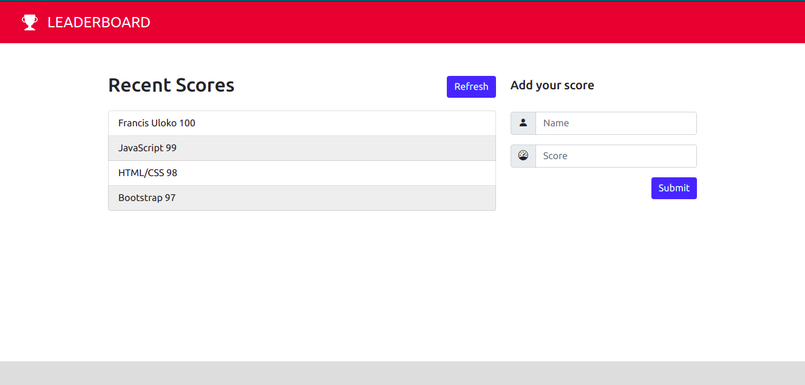

> # Leaderboard

>  A project to build a website to displays scores submitted by different players.

> 

## Live Demo
TBA

## Built With

- JavaScript
- HTML & CSS
- webpack@5.44.0

## Prerequisites

- `browser`
- `vscode`
- `git`

## Clone Repo

To get a local copy up and running follow these simple steps:

   - `Open terminal Ctrl + Alt + T`

   - `git clone git@github.com:francisuloko/leaderboard.git`

   - `cd leaderboard`

   - `npm install`

   - `npm start`

   - `visit localhost:8080`

## Tests
TBA
   

## Author

👤 **Francis Uloko**

- [GitHub](https://github.com/francisuloko)
- [Twitter](https://twitter.com/francisuloko)
- [LinkedIn](https://linkedin.com/in/francisuloko)

## 🤝 Contributing

Contributions, issues, and feature requests are welcome!

Feel free to check the [issues page](https://github.com/francisuloko/leaderboard/issues).

## Show your support

Give a ⭐️ if you like this project!

## Acknowledgments

- Microverse Inc.

## 📝 License

This project is [MIT](https://mit-license.org/) licensed.
